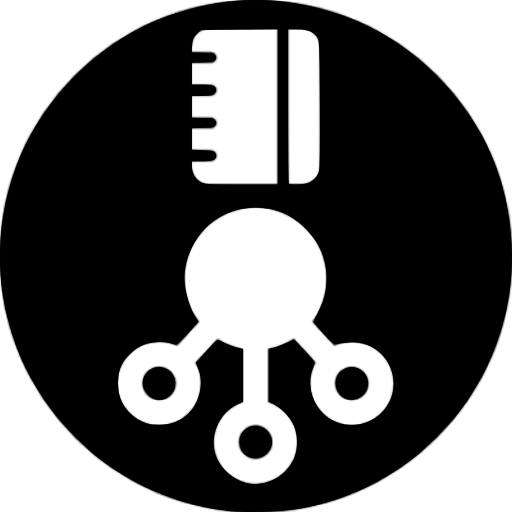
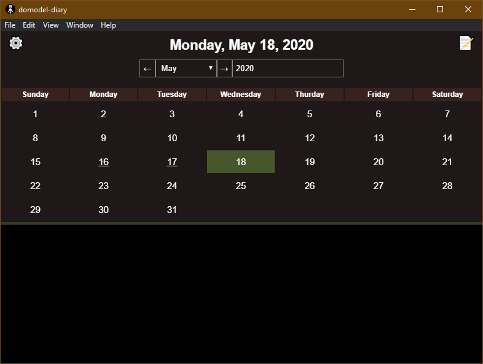

	

# domodel-diary-electron

Electron context for [domodel-diary](https://github.com/thoughtsunificator/domodel-diary)

- Calendar
- Daily notes encrypted using AES
- Password Protected

## Getting started

### Installing

### Run

- npm install
- npm start

### Build

- npm install
- npm run build

The binaries are available in the ``dist/main`` folder.
